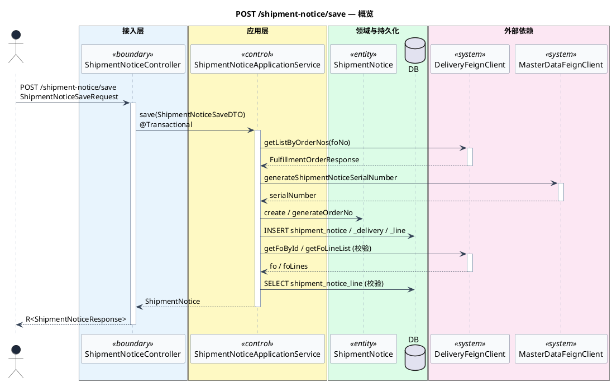
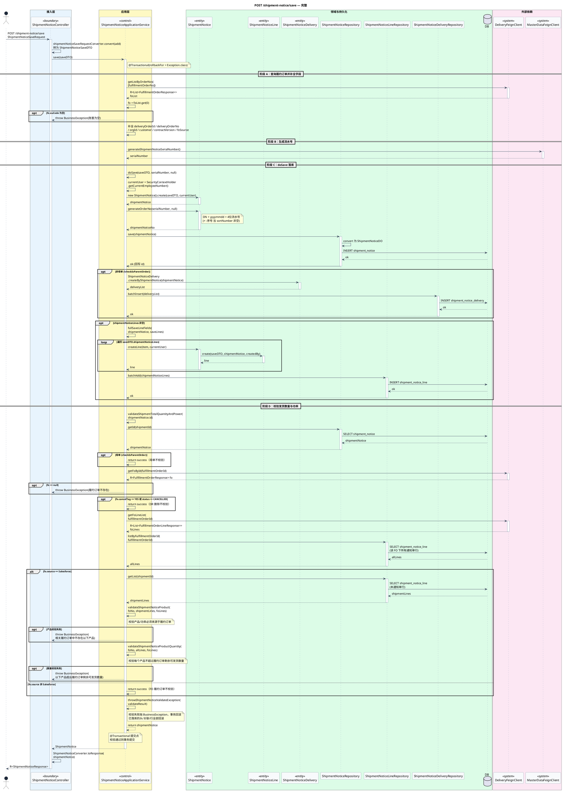

# POST /shipment-notice/save 接口时序图

> **所属微服务**：`oms-ship-notice`
> **入口方法**：`ShipmentNoticeController.add`（`@PostMapping("/save")`，对应应用层 `ShipmentNoticeApplicationService.save`）
> **codegraph 路由**：`POST /shipment-notice/save`
> **分析来源**：codegraph（`E:\OMSCODE\oms-ship-notice`）
> **生成时间**：2026-09-03
> **输出路径**：`逆向知识库/API序列图/oms-ship-notice/shipment-notice-save.md`

## 一、API 时序总体概览

`POST /shipment-notice/save` 是发货通知单「添加」接口，接收 `ShipmentNoticeSaveRequest`，返回 `R<ShipmentNoticeResponse>`。接口为**纯同步流程**，无 AFTER_COMMIT 异步分发：

- **同步主路径**：Controller 将请求转为 `ShipmentNoticeSaveDTO` 后调用 `ShipmentNoticeApplicationService.save`（`@Transactional(rollbackFor = Exception.class)`）。`save` 先通过 `deliveryFeignClient` 查询履约订单（补全交付订单/客户/账套等字段），再通过 `masterDataFeignClient` 生成流水号，然后委托 `doSave` 完成头/行落库与发货数量功率校验。
- **事务范围**：`save` 整体 `@Transactional`，覆盖履约订单查询、流水号生成、头表插入、发货通知-组件订单关联关系插入、行表批量插入、发货数量与功率校验；事务内含对 `oms-deliv-order`（`DeliveryFeignClient`）与主数据（`MasterDataFeignClient`）的远程调用。
- **主路径一句话**：Client → Controller → save（@Transactional：查履约订单 Feign + 生成流水号 Feign → doSave 落库头/关联/行 → 校验发货数量功率 Feign+DB）→ 返回。
- **外部依赖**：`DeliveryFeignClient`（调 `oms-deliv-order`：`getListByOrderNos` 查履约订单、`getFoById` 查履约详情、`getFoLineList` 查履约订单行）、`MasterDataFeignClient`（主数据：`generateShipmentNoticeSerialNumber` 生成流水号）。

### 1.1 参与者一览

| 参与者 | 类型 | 别名 | 职责 |
|--------|------|------|------|
| 调用方 | Actor | Client | HTTP 调用方，提交发货通知保存请求 |
| ShipmentNoticeController | boundary | Ctrl | 接入层，`/save` 入口，DTO 转换与响应封装 |
| ShipmentNoticeApplicationService | control | App | 应用编排，`save`/`doSave` 落库与校验 |
| ShipmentNotice | entity | Domain | 领域聚合根，`create`/`generateOrderNo`/`createLine`/`checkIsParentOrder` |
| ShipmentNoticeLine | entity | LineDomain | 行领域，`create` |
| ShipmentNoticeDelivery | entity | DeliveryRel | 发货通知-组件订单关联，`createByShipmentNotice` |
| ShipmentNoticeRepository | repository | Repo | 头仓储，`save`/`getId` |
| ShipmentNoticeLineRepository | repository | LineRepo | 行仓储，`batchAdd`/`getList`/`listByFulfillmentOrderId` |
| ShipmentNoticeDeliveryRepository | repository | DeliveryRepo | 关联仓储，`batchInsert` |
| DeliveryFeignClient | system | DeliveryFeign | 履约订单 Feign（调 `oms-deliv-order`） |
| MasterDataFeignClient | system | MasterData | 主数据 Feign：流水号生成 |
| DB | database | DB | OMS 数据库（shipment_notice / _line / _delivery） |

### 1.2 主路径摘要

1. Client 提交 `POST /shipment-notice/save` + `ShipmentNoticeSaveRequest`。
2. Controller 调 `shipmentNoticeSaveRequestConverter.convert` 转 `ShipmentNoticeSaveDTO`，再调 `App.save`（`@Transactional`）。
3. `save` 调 `DeliveryFeignClient.getListByOrderNos` 查履约订单，校验 `ouCode` 非空，补全交付订单/客户/账套/合同版本/来源字段。
4. `save` 调 `MasterDataFeignClient.generateShipmentNoticeSerialNumber` 生成流水号，委托 `doSave`。
5. `doSave`：领域 `create` 构建头 → `generateOrderNo` 生成发货通知单号 → 头表 `save` 落库 → 非母单保存关联关系 → 行 `createLine` + `batchAdd` 落库。
6. `doSave` 调 `validateShipmentTotalQuantityAndPower`：查头、查履约订单/履约订单行（Feign）、查发货通知行（DB），按 `fo.source == Salesforce` 校验产品与数量。
7. 校验失败抛 `BusinessException`（事务回滚）；成功返回 `ShipmentNotice`，Controller 转 `ShipmentNoticeResponse` 返回。

### 1.3 概览时序图（主路径）

## 二、完整时序图

本图覆盖接入 → 应用编排 → 领域/持久化 → 外部依赖（Feign）→ 校验的完整消息顺序；条件用 alt/opt，循环用 loop，同步调用均有返回与激活条。本接口为纯同步流程，无 AFTER_COMMIT 异步分发。

## 三、详细说明

### 3.1 阶段拆解

#### 阶段 A：查询履约订单并补全字段
- 对应消息：`App -> DeliveryFeign: getListByOrderNos`、`App -> App: 补全字段`
- 入参：`saveDTO.fulfillmentOrderNo`；出参：`FulfillmentOrderResponse fo`，补全 `deliveryOrderId/deliveryOrderNo/orgId/customer/contractVersion/foSource`
- 关键校验：`fo.ouCode` 为空则抛 `BusinessException(账套为空)`
- 代码举证：`ShipmentNoticeApplicationService.java:554-564`

#### 阶段 B：生成流水号
- 对应消息：`App -> MasterData: generateShipmentNoticeSerialNumber`
- 出参：`serialNumber`（用于生成发货通知单号）
- 代码举证：`ShipmentNoticeApplicationService.java:566`

#### 阶段 C：doSave 落库
- 对应消息：`App -> Domain: create/generateOrderNo`、`App -> Repo: save`、关联关系与行落库
- 领域构建：`ShipmentNotice.create` 填充头字段 → `generateOrderNo` 生成 `DN+yyyymmdd+4位流水号`（`sortNumber` 非空时追加 `-序号`）
- 头落库：`ShipmentNoticeRepositoryImpl.save` → `convert` → `shipmentNoticeMapper.insert`（MyBatis-Plus，主键回写）
- 关联关系：非母单时 `ShipmentNoticeDelivery.createByShipmentNotice` → `batchInsert`（保存发货通知与组件订单关联）
- 行落库：`fullSaveLineFields` 填充 sub-region → `shipmentNotice.createLine`（`ShipmentNoticeLine.create` 设置 `reqShipmentDate/scheduleShipmentTime` 默认当前日期）→ `batchAdd` 批量插入
- 代码举证：`ShipmentNoticeApplicationService.java:649-675`、`ShipmentNotice.java:329-378`、`ShipmentNoticeRepositoryImpl.java:187-192`

#### 阶段 D：校验发货数量与功率
- 对应消息：`App -> Repo: getId`、`App -> DeliveryFeign: getFoById/getFoLineList`、`App -> LineRepo: listByFulfillmentOrderId/getList`、`validateShipmentNoticeProduct/Quantity`
- 流程：查头 → 母单跳过 → 查履约订单（Feign）→ DR 删除跳过 → 查履约订单行（Feign）+ 查该 FO 下所有通知单行（DB）→ 按 `fo.source` 分流
- Salesforce 来源：查本通知单行（DB）→ 校验产品/功率来源于履约订单 → 校验数量不超过履约订单剩余可发货数量
- 非 Salesforce：不校验
- 校验失败：`throwShipmentNoticeValidateException` 抛 `BusinessException`（合同总量超 MW / 产品不存在 / 超剩余数量三类错误）
- 代码举证：`ShipmentNoticeApplicationService.java:3607-3651`、`580-595`

### 3.2 分支、循环与并行

| 片段 | 条件 / 集合 | 走向 | 举证 |
|------|-------------|------|------|
| opt | `fo.ouCode` 为空 | 抛账套为空异常 | `ShipmentNoticeApplicationService.java:556-558` |
| opt | 非母单 `!checkIsParentOrder` | 保存发货通知-组件订单关联 | `ShipmentNoticeApplicationService.java:657-660` |
| opt | `shipmentNoticeLines` 非空 | 行落库 | `ShipmentNoticeApplicationService.java:662-670` |
| loop | 遍历 `shipmentNoticeLines` | 逐行 `createLine` | `ShipmentNoticeApplicationService.java:666-667` |
| opt | 母单 `checkIsParentOrder` | 跳过校验 | `ShipmentNoticeApplicationService.java:3609-3614` |
| opt | `fo == null` | 抛履约订单不存在 | `ShipmentNoticeApplicationService.java:3616-3618` |
| opt | `fo.cancelTag==YES` 或 `status==CANCELLED` | DR 删除跳过校验 | `ShipmentNoticeApplicationService.java:3620-3626` |
| alt | `fo.source == Salesforce` | 产品 + 数量校验 | `ShipmentNoticeApplicationService.java:3633-3644` |
| opt | 产品校验失败 | 抛产品不存在异常 | `ShipmentNoticeApplicationService.java:3641-3643` |
| opt | 数量校验失败 | 抛超剩余数量异常 | `ShipmentNoticeApplicationService.java:3644` |

### 3.3 数据流向

- 请求：`ShipmentNoticeSaveRequest` →（`shipmentNoticeSaveRequestConverter`）→ `ShipmentNoticeSaveDTO`（含 `List<ShipmentNoticeLineSaveDTO>`）
- 履约补全：`DeliveryFeignClient.getListByOrderNos` → `FulfillmentOrderResponse` → 回填 `deliveryOrderId/deliveryOrderNo/orgId/customer/contractVersion/foSource`
- 领域：`ShipmentNoticeSaveDTO` → `ShipmentNotice.create` → `ShipmentNotice`（头，`generateOrderNo` 生成单号）+ `ShipmentNoticeLine.create`（行）+ `ShipmentNoticeDelivery.createByShipmentNotice`（关联）
- 持久化：`ShipmentNotice` → `shipment_notice` 表；`ShipmentNoticeLine` → `shipment_notice_line` 表；`ShipmentNoticeDelivery` → `shipment_notice_delivery` 表
- 响应：`ShipmentNotice` →（`ShipmentNoticeConverter.toResponse`）→ `ShipmentNoticeResponse`

### 3.4 事务与异常

- **事务边界**：`save` 整体 `@Transactional(rollbackFor = Exception.class)`，覆盖阶段 A-D 全部 Feign 调用与落库。
- **回滚**：阶段 A `ouCode` 为空、阶段 D `fo==null`、产品/数量校验失败 → 抛 `BusinessException`，已落库的头/关联/行整体回滚。
- **事务内远程调用**：阶段 A `getListByOrderNos`、阶段 B `generateShipmentNoticeSerialNumber`、阶段 D `getFoById`/`getFoLineList` 均为事务内 Feign 调用，事务持有时间随远程响应增长。
- **无 AFTER_COMMIT**：本接口不发布领域事件，无 `@TransactionalEventListener`，纯同步返回。

### 3.5 风险与注意事项

- **事务内多次远程调用**：单次保存触发 4 次 Feign 调用（`getListByOrderNos`、`generateShipmentNoticeSerialNumber`、`getFoById`、`getFoLineList`），事务持有时间长，长事务风险高；任一 Feign 超时/失败导致事务回滚，已落库数据丢失。
- **流水号生成在事务内**：`generateShipmentNoticeSerialNumber` 在事务内调用，若后续校验失败回滚，已消耗的流水号不回收，可能造成流水号空洞。
- **校验依赖远程数据**：发货数量校验依赖 `getFoLineList`（Feign）与 `listByFulfillmentOrderId`（DB），Feign 数据与 DB 数据的时间窗口可能导致校验偏差（并发场景下其他通知单正在写入）。
- **N+1 / 远程放大**：`validateShipmentTotalQuantityAndPower` 内多次 DB 查询（`getId`、`listByFulfillmentOrderId`、`getList`）与 Feign 调用，批量场景下放大。
- **幂等性**：接口无显式幂等键，重复提交产生多条发货通知单；`shipmentNoticeNo` 由流水号 + 日期生成，无去重保护。
- **母单/子单差异**：母单跳过关联关系保存与数量校验，业务上需确认母单是否需要其他校验。

## 四、证据不足项

| 步骤 | 缺失原因 |
|------|----------|
| `fullSaveLineFields` 内 sub-region 填充的具体取值逻辑 | codegraph 仅给出方法签名，未展开内部实现，按「填充 sub-region 字段」概括 |
| `ShipmentNoticeDelivery.createByShipmentNotice` 关联关系构建的具体字段 | 方法体未完整呈现，仅标注「创建关联」 |
| `validateShipmentNoticeProduct` / `validateShipmentNoticeProductQuantity` 内部比对算法 | 方法体未完整呈现，仅按业务语义标注「校验产品/功率」「校验数量」 |
| `DeliveryFeignClient` 各方法的 Feign 接口签名与目标路径 | Feign 接口定义未在本次输出中完整呈现，按业务语义命名 |
| `shipmentNoticeSaveRequestConverter` 的字段映射细节 | 转换器实现未深入展开，仅标注 DTO 转换 |
| `ShipmentNoticeLine.create` 中 `fullField(saveDTO)` 的完整字段填充 | 仅见 `create` 部分逻辑，`fullField` 内部未展开 |
