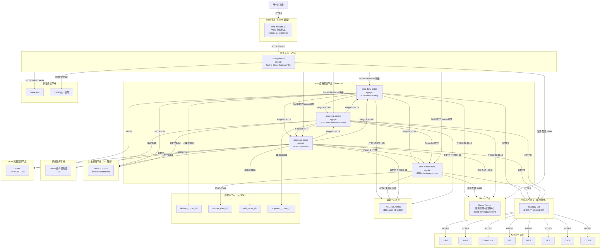

# OMS 系统架构图

> 本架构图展示 OMS 订单管理系统从用户浏览器到后端微服务、再到外部业务系统的完整调用链路与部署关系。
> 微服务：`oms-deliv-order`、`oms-master-data`、`oms-sale-order`、`oms-ship-notice`、`oms-website-ui`、`oms-gateway`。
> 默认环境以 `dev` profile 为代表。

## 系统架构图（Mermaid flowchart TB）

## 节点说明

| 节点 | 类型 | 部署内容 | 说明 |
|---|---|---|---|
| **Web 节点** | Docker 容器（nginx:1.27-alpine） | oms-website-ui 静态制品 | Vue3 + Vite 构建产物，Nginx 托管，监听 80；dev API 指向 `oms-api-dev.trinasolar.com/api` |
| **网关节点** | JVM（Spring Boot） | oms-gateway `app.jar` | Spring Cloud Gateway，端口 80；按路径路由 `/api/delivery`、`/api/sales`、`/api/shipment-notice`、`/api/master-data` 到对应服务；集成 IAM 鉴权与 TASP 权限校验 |
| **OMS 应用服务节点** | JVM（Java 17）x4 | 4 个微服务 `app.jar` | oms-deliv-order / oms-master-data / oms-sale-order / oms-ship-notice；均注册到 Nacos，使用 Feign 经 Nacos 负载均衡互调 |
| **Nacos 节点** | 服务注册/配置中心 | Nacos Server | 端口 8848，namespace=oms；提供服务发现与配置共享 |
| **数据库节点** | MySQL | 4 个 schema | delivery_order_db / master_data_db / sale_order_db / shipment_notice_db；dev 主机 `172.22.8.83:3306`；Flyway 迁移 |
| **调度中心节点** | XXL-Job Admin | XXL-Job 调度平台 | 各服务以执行器注册（端口 9999），由 Admin 统一调度 |
| **对象存储节点** | S3 兼容存储 | Trina TOS | bucket `s3omstest`，用于文件上传/下载 |
| **邮件服务节点** | SMTP 服务器 | Trina 邮件 | 发件人 `S-OMS@trinasolar.com` |
| **认证授权节点** | IAM + TASP | 统一登录与权限 | IAM OAuth 鉴权；TASP 统一权限校验 |
| **Trina API 网关节点** | 集成总线 | tslapigw-uat | 统一承载对外部业务系统的 API 路由与鉴权 |
| **BPM 流程引擎节点** | 流程引擎 | BPM 服务 | 被 deliv-order 与 sale-order 直接调用（未走 tslapigw） |

## 关键调用链路

### 用户登录 → 首页加载

1. 用户浏览器 → `oms-website-ui` (HTTPS/443)
2. `oms-website-ui` → `oms-gateway` (HTTPS `/api/**`)
3. `oms-gateway` → IAM (OAuth 鉴权)
4. `oms-gateway` → TASP (权限校验)
5. `oms-gateway` → `oms-deliv-order` (Nacos lb 路由) → `/api/homepage/**`
6. `oms-deliv-order` → MySQL (查询组件订单统计) + Feign → `oms-sale-order` / `oms-ship-notice` 聚合数据

### 组件订单 BPM 审批

1. 用户 → `oms-website-ui`
2. → `oms-gateway` → `oms-deliv-order` `POST /api/delivery/delivery-orders/bpm-approval`
4. `oms-deliv-order` → BPM Feign → `10.40.38.71:88/api/workflow/oms`
5. BPM 回调 → `oms-deliv-order` 更新 `bpm_approval_status`

### 发货通知一键发送

1. 用户点击"一键发送" → `oms-ship-notice` `POST /api/shipment-notice/shipment-notices/issue-multi-lines`
2. 主路径包含 WMS 下发（`issue-wms`）→ `WmsFeignClient.issueNotice` → tslapigw → WMS
3. 主路径包含 TMS 下发（`issue-tms`）→ `TmsFeignClient.syncShipmentBillDetails` → tslapigw → TMS
4. 主路径包含发送邮件（`send-multi-lines-mail`）→ SMTP `mail.trinasolar.com:25`

## 网络协议汇总

| 协议 | 用途 | 端口 |
|---|---|---|
| HTTPS/443 | 浏览器 → Web 节点、外部 API | 443 |
| HTTP/80 | 网关 → 应用服务（Nginx 反代 / lb 路由） | 80 |
| HTTP/8080 | 应用服务（`oms-deliv-order` / `oms-master-data` / `oms-sale-order`） | 8080 |
| HTTP/8081 | 应用服务（`oms-ship-notice` dev） | 8081 |
| HTTP/8848 | 微服务 → Nacos（注册 + 配置） | 8848 |
| HTTP/30011 | XXL-Job Admin | 30011 |
| HTTP/9999 | XXL-Job 执行器（各服务内嵌） | 9999 |
| JDBC/3306 | 应用服务 → MySQL | 3306 |
| SMTP/25 | 应用服务 → 邮件服务器 | 25 |
| HTTPS | 应用服务 → S3 / tslapigw / IAM / TASP | 443 |
| HTTP/88 | BPM 流程引擎 | 88 |