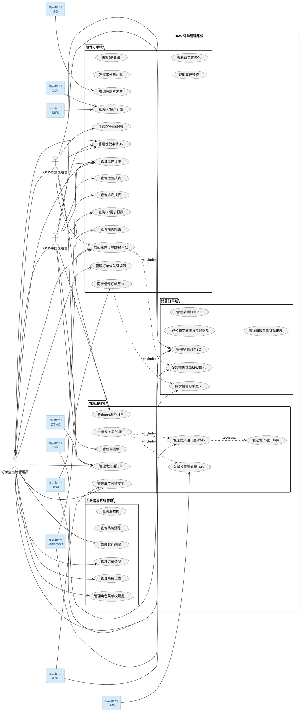
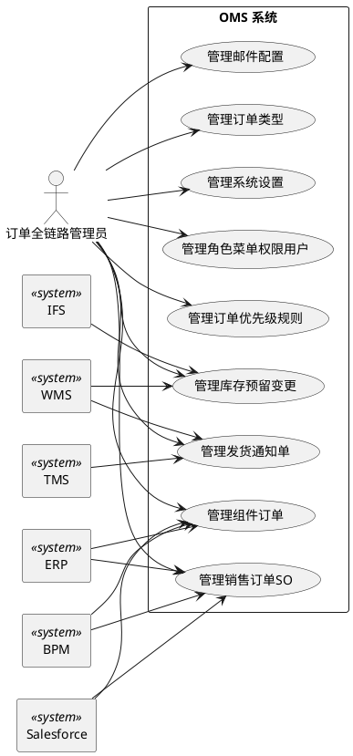
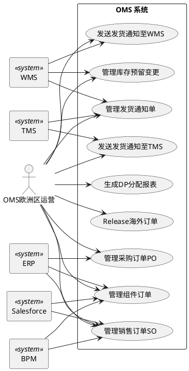
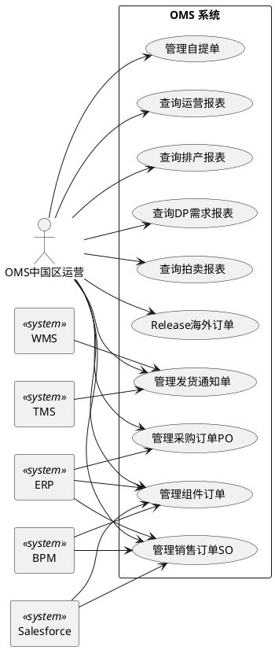

# OMS 订单管理系统 — 测试用例（PlantUML）

> 数据源：逆向建模自 `oms-deliv-order` / `oms-master-data` / `oms-sale-order` / `oms-ship-notice` 等微服务源码与权限矩阵。
> 本页内嵌 **4 张 PlantUML 用例图**：1 张总览 + 3 张分角色。图表源文经公共 PlantUML 服务渲染。

## 一、用例总览图

本图展示 OMS 系统全部人员角色（订单全链路管理员、OMS欧洲区运营、OMS中国区运营）、9 个外部集成系统（ERP / WMS / TMS / OTMS / Salesforce / BPM / IFS / MES / SCP）与 30 个用例之间的整体关系。Admin 泛化 Eu / Cn 两个运营角色；一键发送发货通知 include 调用发送 WMS / 发送 TMS；发送 WMS include 调用发送邮件；组件订单 BPM 审批 include 调用销售订单 BPM 审批。

## 二、订单全链路管理员用例图

订单全链路管理员是 OMS 的最高权限角色，继承欧洲区与中国区运营的全部业务用例权限，并额外独占系统管理类用例（邮件配置、订单类型管理、系统设置、订单优先级规则、角色 / 菜单 / 权限 / 用户管理）。

## 三、OMS欧洲区运营用例图

OMS欧洲区运营负责欧洲区域的订单全链路日常业务，覆盖组件订单、发货申请、DP 排产、销售 / 采购订单、发货通知、库存预留等运营用例，并独占"生成DP分配报表（欧洲区DP分配报表）"。该角色不包含中国区排产 / 拍卖类报表，也不包含系统管理类用例。

## 四、OMS中国区运营用例图

OMS中国区运营负责中国区域的订单全链路日常业务，覆盖组件订单、发货申请、DP 排产、销售 / 采购订单、发货通知、自提单、库存预留等运营用例，并独占中国区报表类用例（运营报表、排产报表、DP需求报表、拍卖台账 / 出库报表）。该角色不包含"生成DP分配报表（欧洲区）"，也不包含系统管理类用例。

## 五、角色—用例差异总结

| 用例类别 | 管理员 Admin | 欧洲区 EuOp | 中国区 CnOp |
|---|---|---|---|
| 业务核心（订单 / 发货 / 库存） | ✓ | ✓ | ✓ |
| 生成DP分配报表（欧洲区） | ✓ | ✓ | ✗ |
| 运营报表 / 排产 / DP需求 / 拍卖报表 | ✓ | ✗ | ✓ |
| 管理订单优先级规则 | ✓ | ✗ | ✗ |
| 管理邮件配置 / 订单类型 / 系统设置 | ✓ | ✗ | ✗ |
| 管理角色 / 菜单 / 权限 / 用户 | ✓ | ✗ | ✗ |

> 鉴权说明：OMS 后端 Controller 未使用 `@PreAuthorize` 等方法级注解，鉴权在 `oms-gateway` 网关层基于资源路径统一拦截。