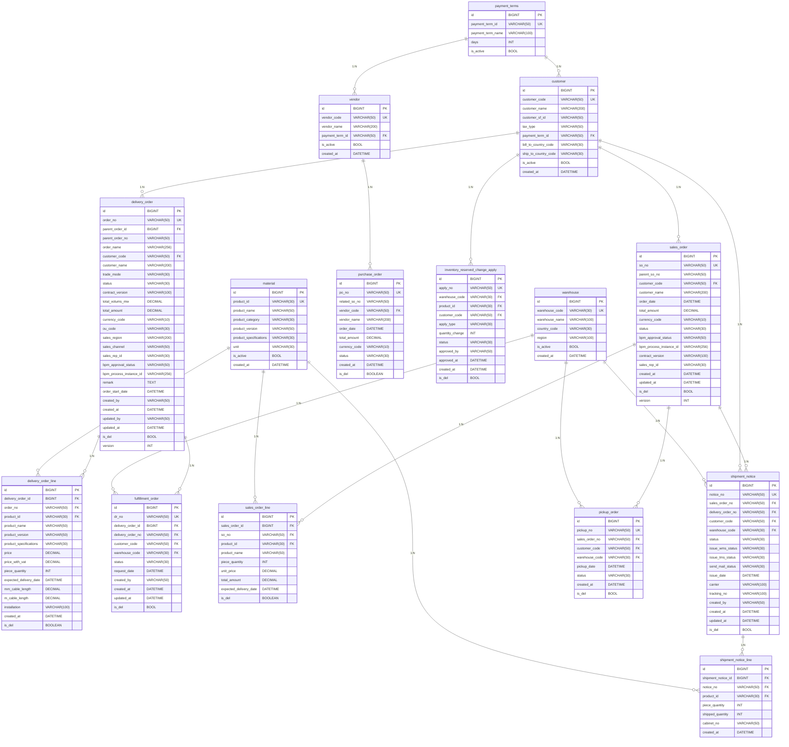

# 物理 ER 图（核心表）

> 数据源：TrinaSolar OMS 微服务项目（MySQL 8.0 / InnoDB / utf8mb4，Flyway 迁移脚本）。
> 本系统所有表均**未定义物理外键约束**（FOREIGN KEY），表间关系为**逻辑关联**（通过 `xxx_id` / `xxx_no` 字段维护），图中的 FK 标注含义为**逻辑外键字段**。
> Mermaid erDiagram 语法仅支持 PK/FK/UK 三种键标记；非空（NN）、自增（AI）等约束请见下方的「表结构说明」表。
> 本图仅展示跨域核心实体（约 15 张），完整表数 127（交货订单 44 / 主数据 41 / 销售订单 17 / 发运通知 25）。

## 图例

- **PK**：主键
- **FK**：逻辑外键（应用层维护）
- **UK**：唯一（UNIQUE）

## 物理 ER 图（核心表）

## 表结构说明

| 表名 | 所属服务 | 物理主键 | 逻辑外键示例 | 备注 |
|---|---|---|---|---|
| `delivery_order` | oms-deliv-order | `id` BIGINT | `parent_order_id`, `customer_code`, `sales_rep_id` | 组件订单主表 |
| `delivery_order_line` | oms-deliv-order | `id` BIGINT | `delivery_order_id`, `product_id` | 组件订单行项目 |
| `fulfillment_order` | oms-deliv-order | `id` BIGINT | `delivery_order_id`, `warehouse_code` | 发货申请 DR |
| `sales_order` | oms-sale-order | `id` BIGINT | `customer_code`, `parent_so_no` | 销售订单 SO 主表 |
| `sales_order_line` | oms-sale-order | `id` BIGINT | `sales_order_id`, `product_id` | 销售订单行 |
| `purchase_order` | oms-sale-order | `id` BIGINT | `vendor_code`, `related_so_no` | 采购订单 PO |
| `shipment_notice` | oms-ship-notice | `id` BIGINT | `sales_order_no`, `delivery_order_no` | 发货通知单 |
| `shipment_notice_line` | oms-ship-notice | `id` BIGINT | `shipment_notice_id`, `product_id` | 发货通知行 |
| `inventory_reserved_change_apply` | oms-ship-notice | `id` BIGINT | `product_id`, `warehouse_code` | 库存预留变更申请 |
| `pickup_order` | oms-ship-notice | `id` BIGINT | `sales_order_no`, `warehouse_code` | 自提单 |
| `customer` | oms-master-data | `id` BIGINT | `payment_term_id` | 客户主数据 |
| `vendor` | oms-master-data | `id` BIGINT | `payment_term_id` | 供应商主数据 |
| `material` | oms-master-data | `id` BIGINT | — | 物料主数据 |
| `warehouse` | oms-master-data | `id` BIGINT | — | 仓库主数据 |
| `payment_terms` | oms-master-data | `id` BIGINT | — | 付款条件 |

## 物理特性

- **存储引擎**：InnoDB
- **字符集**：`utf8mb4` / `utf8mb4_unicode_ci`
- **连接池**：HikariCP
- **迁移工具**：Flyway
- **逻辑删除**：所有业务表 `is_del BOOL` 字段（0 = 有效，1 = 已删除）
- **乐观锁**：核心单据表 `version INT` 字段
- **审计字段**：所有表 `created_by` / `created_at` / `updated_by` / `updated_at`